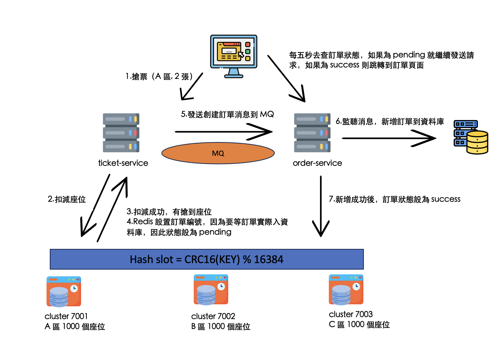

# 搶票系統-後端

## 專案環境要求

- Java 17
- Redis, Zookeeper, RabbitMQ, Docker

## 下載專案

請從以下網址 Clone 此專案：
[https://github.com/samtash1034/Ticket-Grabber-Backend.git](https://github.com/samtash1034/Ticket-Grabber-Backend.git)

### 創建資料庫

進入專案根目錄，找到 `schema.sql` 檔案，並執行其中的 SQL 語句以初始化資料庫。

### 修改 TODO 設定
尋找專案中所有 TODO 註解的位置，將相關資訊修改成自己環境的配置。
   - 資料庫連線資訊
   - Redis 相關配置
   - Zookeeper 相關配置

### 執行 Maven Build
在專案目錄下執行以下指令：
```sh
mvn clean install
```


## 啟動 Docker

執行以下指令以啟動 Docker 中的各個服務：

```sh
docker-compose up -d
```

啟動成功後，可打開 Docker Desktop GUI 查看所有啟動中的服務。


## Redis Cluster 設定

1. 在終端機輸入以下指令以建立 Redis Cluster：
   - 記得將 IP 替換為您本機的 IP（需要先安裝 Redis）。
   ```sh
   redis-cli --cluster create 192.168.0.109:7001 192.168.0.109:7002 192.168.0.109:7003 --cluster-replicas 0
   ```

## 啟動專案服務

照順序啟動以下服務：

- config-server
- gateway-service
- ticket-service
- order-service

（`user-service` 可選，不必啟動）

## 查看 RabbitMQ Queue

進入 RabbitMQ 管理介面查看 queue：

- URL: [http://localhost:15672/#/queues](http://localhost:15672/#/queues)
- 帳號密碼：`guest` / `guest`

可看到有一個 `concertOrderQueue`：


## Redis GUI（可選）

1. 下載 Redis Insight，並建立三個 Redis Cluster 連線：

   - 127.0.0.1:7001
   - 127.0.0.1:7002
   - 127.0.0.1:7003
   - 帳號密碼不需設定。

2. 點擊任意 cluster，可以看到座位資訊已被初始化（參考 `ticket-service`）。


## 驗證座位區域分佈在不同的 Redis Cluster 上

### Redis 中的座位資料會根據 key 進入不同的 cluster，以減輕 Redis 的負擔。


### 查看座位對應的 cluster key slot：


```sh
redis-cli -c -h 127.0.0.1 -p 7001 CLUSTER KEYSLOT concert:1-A-{k2}
redis-cli -c -h 127.0.0.1 -p 7001 CLUSTER KEYSLOT concert:1-B-{k4}
redis-cli -c -h 127.0.0.1 -p 7001 CLUSTER KEYSLOT concert:1-C-{k5}
```

查看 Redis Cluster nodes 狀態：

```sh
redis-cli -c -h 127.0.0.1 -p 7001 CLUSTER NODES
```

### 範例輸出：

```
2a7aa8a8ed65a831e6f0e79546a39b6eb845b3ef 192.168.0.109:7002@17002 master - 0 1731830641736 2 connected 5461-10922
482cbf234db3cdb96b4414d30e5fd81b22cab487 192.168.0.109:7001@17001 myself,master - 0 1731830639000 1 connected 0-5460
e1be2688943c39ab31858fc245c9abcd052d50e1 192.168.0.109:7003@17003 master - 0 1731830640723 3 connected 10923-16383
```

### 結論

concert:1-A-{k2}: 哈希槽屬於範圍 0-5460，對應節點 192.168.0.109:7001。

concert:1-B-{k4}: 哈希槽屬於範圍 5461-10922，對應節點 192.168.0.109:7002。

concert:1-C-{k5}: 哈希槽屬於範圍 10923-16383，對應節點 192.168.0.109:7003。

## 流程圖



